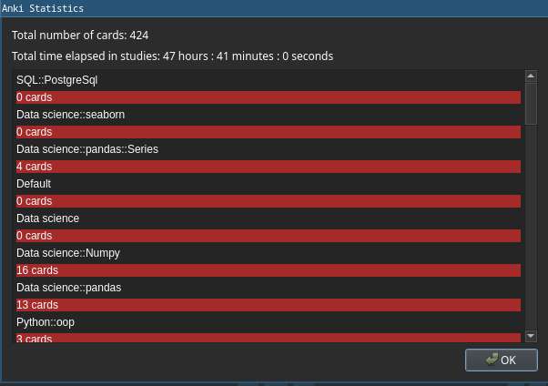

# 
Anki Insights 

Track and analyze your Anki usage with detailed statistics and visualizations.
  

## Installation

Install from [Anki-Web](https://ankiweb.net/shared/info/1181998145)  
Or through Anki via: Tools -> Add-ons -> Get Add-ons...
> 1181998145

#### Bugs/Issues:

Please post any issues/feedback you might have over the project's
on [GitHub](https://github.com/JithinSukumaran/anki-insights/issues).
  

Wish you the best! -Jithin

MIT License ©2022-2023